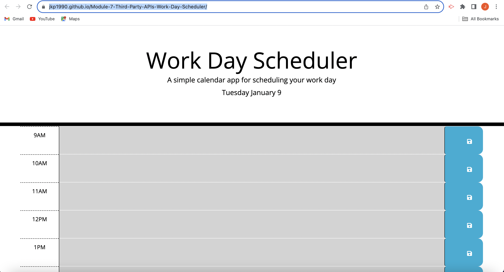

# Unit 7 - Third-Party APIs: Work Day Scheduler

## Description

Work day scheduler- A simple calendar app for scheduling your work day

## Deployed Link

[Work Day Scheduler](https://jkp1990.github.io/Module-7-Third-Party-APIs-Work-Day-Scheduler/)

## Screenshot

## Usage

You would need to load up the work day scheduler and enter an event and press the save button

## Credits

n/a

## License

License is MIT
